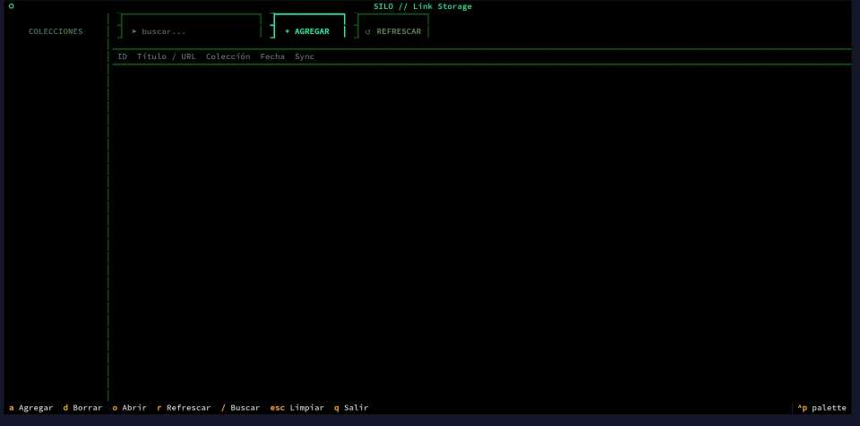

# silo-tui

Cliente TUI (interfaz de texto) para [Silo](https://codeberg.org/osdaeg/silo), el gestor de enlaces autoalojado. Basado en [Textual](https://textual.textualize.io/).



## Requisitos

- Python 3.10+
- `textual` >= 8.0
- `httpx`

## Instalación

```bash
python3 -m venv ~/.venv/silo
source ~/.venv/silo/bin/activate
pip install textual httpx
```

## Configuración

Mediante variables de entorno:

```bash
export SILO_HOST=http://192.168.1.10:7123
export SILO_TOKEN=tu_token
```

Si no se definen, usa los valores por defecto: `http://192.168.1.10:7123` y `changeme`.

## Uso

```bash
source ~/.venv/silo/bin/activate
python3 silo-tui.py
```

### Script de lanzamiento (recomendado)

Creá un script `silo.sh` para simplificar el arranque:

```bash
#!/bin/bash
SILO_HOST=http://192.168.1.10:7123
SILO_TOKEN=tu_token

source ~/.venv/silo/bin/activate
python3 /ruta/a/silo-tui.py
deactivate
```

```bash
chmod +x silo.sh
```

## Atajos de teclado

| Tecla | Acción |
|---|---|
| `a` | Agregar enlace |
| `d` | Borrar enlace seleccionado |
| `o` | Abrir enlace en el navegador |
| `r` | Refrescar |
| `/` | Buscar |
| `Esc` | Limpiar búsqueda |
| `↑ ↓` | Navegar enlaces |
| `q` | Salir |

## Funcionalidades

- Listado de enlaces con título, colección, fecha y estado de sync con Raindrop
- Filtro por colección desde el sidebar
- Búsqueda en tiempo real
- Agregar enlaces con autodetección de título
- Borrar enlaces con confirmación
- Abrir enlaces directamente en el navegador (`xdg-open`)

## Servidor

Este cliente requiere una instancia de [Silo](https://codeberg.org/osdaeg/silo) corriendo y accesible.
